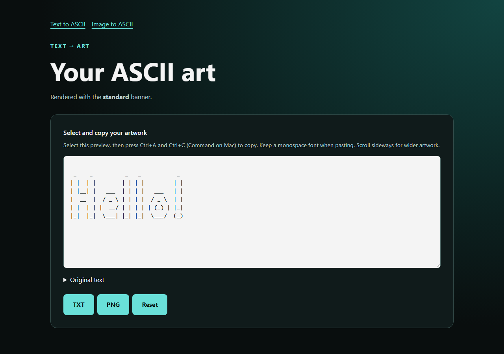

# ASCII Studio: Text & Image Art Generator

A Go web application that converts text and images into ASCII artwork, with
adjustable image filters and TXT/PNG downloads. Built with the Go standard
library, server-rendered HTML, responsive CSS, and JavaScript enhancements.
No external Go modules, database, npm packages, or frontend build step are required.



## Features

- **Text conversion:** Standard, Shadow, and Thinkertoy banners covering all
  printable ASCII characters, with preserved spaces and multiline input.
- **Image conversion:** PNG, JPEG, and GIF uploads, local image previews,
  adjustable output width, five character gradients, and space density.
- **Image filters:** brightness, contrast, saturation, hue, grayscale, sepia,
  inversion, thresholding, sharpening, and edge detection, plus smooth sampling
  and automatic contrast normalization.
- **Live updates:** debounced adjustments with protection against stale responses
  and synchronized download contents.
- **Downloads:** plain-text artwork and PNG exports with optional transparent
  outer padding.
- **Responsive interface:** keyboard-accessible controls and conversion, settings,
  and downloads that also work with JavaScript disabled.
- **Portable build:** embedded banners, templates, and assets allow the executable
  to run without separate resource files.

## Getting started

Requires **Go 1.23 or newer**.

From the repository root:

```sh
go run .
```

Open **http://127.0.0.1:8080**. Stop the server with **Ctrl+C**.

To use another port:

```sh
go run . -addr 127.0.0.1:9090
```

### Standalone build

```sh
go build -o ascii-studio .
./ascii-studio
```

On Windows:

```powershell
go build -o ascii-studio.exe .
.\ascii-studio.exe
```

Rebuild after changing templates, banners, or assets. The server binds to
loopback by default; use `-addr 0.0.0.0:8080` for access from other machines.
The application serves HTTP; HTTPS requires a reverse proxy.

## Usage

**Text to ASCII:** enter text, choose a banner, and select **Generate ASCII art**.
Copy from the selectable preview or download TXT/PNG. Use a monospace font when
pasting the artwork.

**Image to ASCII:** choose an image and select **Convert image**. Adjust sliders,
gradients, and filters to update the result automatically. Filter strengths apply
when their checkbox is selected. **Space Density** adds spaces to the light end
of the gradient; **Transparent PNG frame** adds clear padding to PNG downloads.

Selecting a replacement image requires **Apply settings** before live updates
resume. With JavaScript disabled, use Apply settings for every adjustment.
Downloads are disabled during pending or failed live updates; Apply settings or
another control change retries. **Reset** opens a fresh form.

Images are processed in memory and are not saved by the application. A bounded
PNG preview is retained in the form so settings can be reapplied without
reselecting the file.

## Technical design

```text
main.go          Embedded resources, server configuration, graceful shutdown
src/asciiart/    Banner validation, text rendering, PNG rasterization
src/imageart/    Image sampling, filters, luminance-to-character mapping
src/server/      HTTP handlers, input validation, templates, downloads
banners/         Three bundled banner fonts
templates/       Server-rendered pages
assets/          CSS, browser scripts, favicon
```

Banner glyphs are validated and cached at startup. The HTTP layer bounds request
sizes and checks image dimensions before decoding. Templates use automatic HTML
escaping and buffered rendering; security headers and server timeouts protect
the request boundary.

Live updates reuse the HTML conversion endpoint. Superseded requests are aborted,
and revision checks prevent older responses from replacing newer results.
PNG exports rasterize bundled Thinkertoy glyphs in fixed-size cells, avoiding a
platform font dependency; their appearance differs from the browser preview.

## Development checks

```sh
go vet ./...
gofmt -l main.go src
go build .
```

No output from `gofmt -l` means formatting is correct. GitHub Actions runs these
checks and JavaScript syntax checks on Linux and Windows. JavaScript syntax can
also be checked locally with Node.js:

```sh
node --check assets/image-preview.js
node --check assets/image-controls.js
```

Node.js is only needed for these syntax checks, not to build or run the app.

## Limits

- Text supports up to 100 printable ASCII characters and line breaks. Tabs,
  Unicode, and newline-only input are rejected; browser CRLF is normalized to LF.
- Images are limited to 10 MiB and 24 million pixels. GIF uses its first frame;
  WebP and BMP are not supported.
- Conversion uses a source preview of at most 600px on its longest side, with
  20–300 columns and at most 300 rows. Output is monochrome; very tall images may
  appear compressed.
- PNG exports are limited to 16,384px per side and 24 million pixels, with up to
  100px of transparent outer padding. Oversized artwork can be downloaded as TXT
  within the 100,000-character export limit.

## Credits

Originally created as a collaborative learning project by **Hamza Cheema**
(`hcheema`) and **Husain Hanoon** (`hhanoon`).

No license file is currently included.
